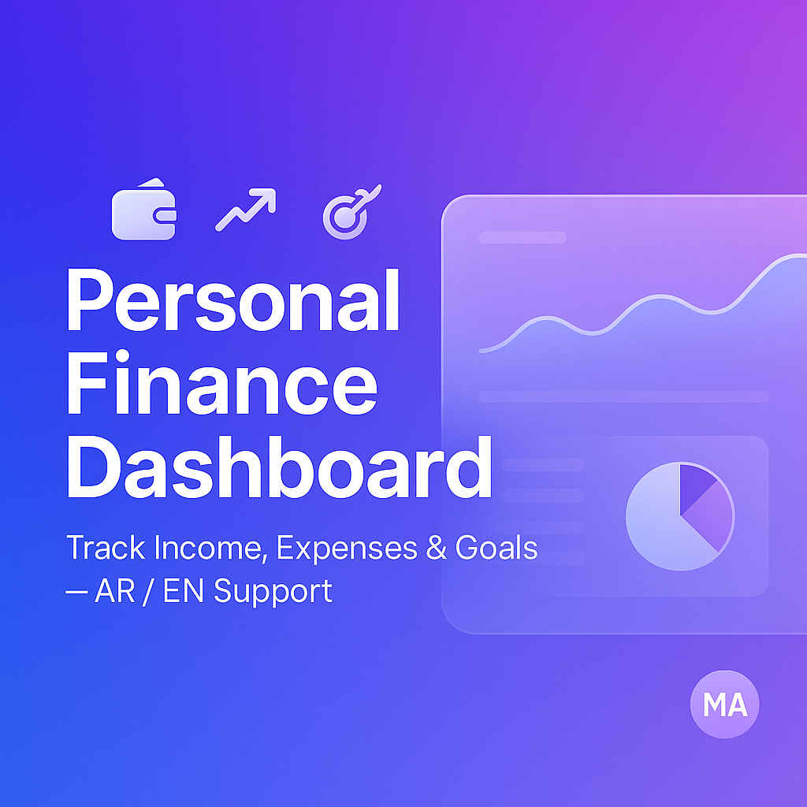

# Personal Finance Dashboard

A modern, bilingual (AR/EN) personal finance dashboard to track **income**, **expenses**, **savings**, and **financial goals** — built with **Next.js 14**, **TypeScript**, **ShadCN UI**, and full **RTL / LTR support**.

This project provides a clean, intuitive interface for managing monthly finances with local storage, theming, charts, and complete i18n support.



---

## 🚀 Features

### 📌 Core
- 💸 Track income and expenses
- 🎯 Create and monitor financial goals
- 📊 Visual analytics (line charts, pie charts)
- 💾 LocalStorage-based persistence
- 🌍 Full Arabic & English support
- ↔️ Automatic RTL/LTR layout switching
- 🎨 Light / Dark / System themes
- 💱 Currency selection (USD, ILS, EUR, AED, SAR)
- 🗂 Manage custom categories
- ⬆️ Export & import finance data as JSON

### 🛠 Technical
- ⚡ Built with **Next.js 14 App Router**
- 🎨 UI powered by **ShadCN + Tailwind CSS**
- 🔠 i18n via custom localization context
- 📦 State persistence via `localStorage`
- 📈 Recharts for analytics
- 🔧 ESLint + Prettier + TypeScript strict mode

---
## 🧩 Localization (i18n)

The project includes **full localization**:

- `locales.json` contains all translations  
- `LocaleContext` handles language switching  
- Automatic direction change (`dir="rtl"`)

Example:

```json
{
  "dashboard": {
    "title": "Dashboard",
    "totalIncome": "Total Income",
    "totalExpenses": "Total Expenses"
  }
}
```
Arabic keys included as well.

📦 Installation
```bash
git clone https://github.com/mahmoudalshukri/finance-dashboard
cd finance-dashboard
npm install
npm run dev
```

🤝 Contributing
Pull requests are welcome!
If you'd like to contribute:
- Fork the repo
- Create a new branch
- Commit your changes
- Open a PR

⭐ Support
If you like this project, consider giving it a ⭐ on GitHub.
